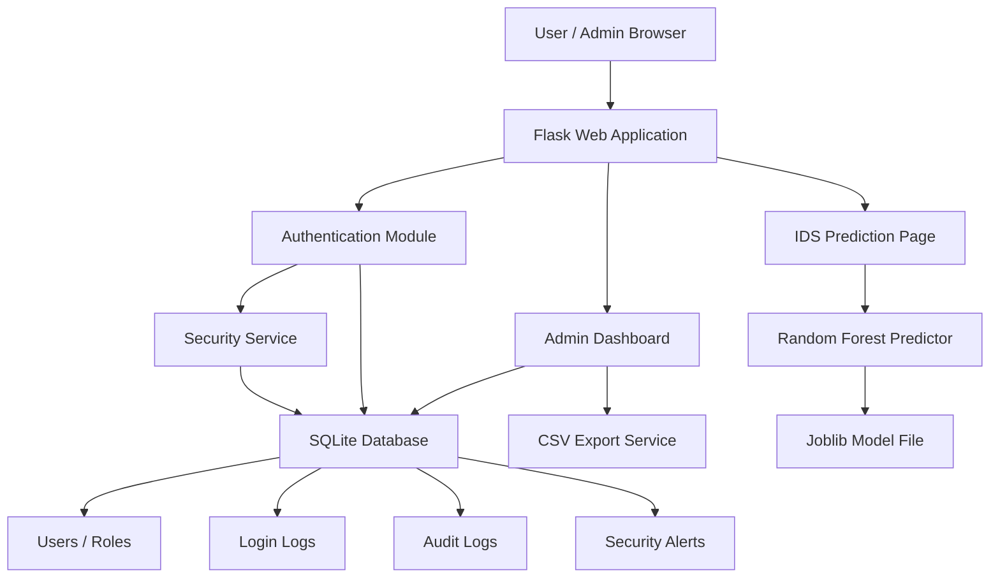

# AI-Driven SIEM with Random Forest IDS

## Project Overview

AI-Driven SIEM with Random Forest IDS is a Flask-based cybersecurity web application for authentication analytics. It monitors login activity, records telemetry, generates audit logs, raises security alerts, supports administrator review, exports CSV evidence, and provides an IDS prediction page that classifies authentication behavior as `Normal` or `Attack`.

The project combines secure web development, database-backed monitoring, and machine learning into a complete B.Tech submission and portfolio-ready application.

## Problem Statement

Traditional login systems usually validate credentials but do not provide enough visibility into failed attempts, suspicious login behavior, account lockouts, or incident history. Manual log analysis is slow and unreliable. This project solves that problem by building a lightweight SIEM-style application that records authentication telemetry, detects suspicious events, and integrates a Random Forest based IDS model.

## Objectives

- Implement secure user registration, login, logout, and session handling.
- Store users, roles, login logs, audit logs, and security alerts in SQLite.
- Track failed logins and lock accounts after repeated invalid attempts.
- Provide an administrator dashboard for monitoring users, alerts, and telemetry.
- Train and integrate a Random Forest IDS model.
- Classify authentication traffic as `Normal` or `Attack`.
- Export SIEM records as CSV files.
- Provide automated tests and academic documentation.

## Features

- Flask authentication system
- Role-based admin access
- User management visibility
- SQLite database integration
- Password hashing
- CSRF-protected forms
- Session expiry configuration
- Login telemetry recording
- Failed login lockout
- Audit logging
- Security alert generation and resolution
- Random Forest IDS model
- IDS prediction page
- CSV exports for alerts and login logs
- Automated unit tests
- GitHub Actions test workflow
- Academic report, diagrams, PPT content, viva Q&A, and synopsis

## Technology Stack

| Layer | Technology |
|---|---|
| Language | Python |
| Web Framework | Flask |
| ORM | Flask-SQLAlchemy |
| Authentication | Flask-Login |
| CSRF Protection | Flask-WTF |
| Rate Limiting | Flask-Limiter |
| Database | SQLite |
| Machine Learning | Scikit-learn Random Forest |
| Data Processing | Pandas, NumPy |
| Model Serialization | Joblib |
| Testing | Python unittest |
| CI | GitHub Actions |

## System Architecture



More diagrams are available in [`docs/02_DIAGRAMS.md`](docs/02_DIAGRAMS.md).

## Installation Guide

### 1. Clone the Repository

```bash
git clone <repository-url>
cd "Cryptography Algorithms Implementation"
```

### 2. Create a Virtual Environment

```bash
python -m venv .venv
```

Windows:

```powershell
.\.venv\Scripts\activate
```

Linux/macOS:

```bash
source .venv/bin/activate
```

### 3. Install Dependencies

```bash
pip install -r requirements.txt
```

### 4. Configure Environment

Copy the example environment file:

```bash
copy .env.example .env
```

On Linux/macOS:

```bash
cp .env.example .env
```

Edit `.env` and set secure values for:

- `SECRET_KEY`
- `ADMIN_EMAIL`
- `ADMIN_PASSWORD`

### 5. Initialize Database and Admin User

```bash
python scripts/seed_admin.py
```

### 6. Train the IDS Model

```bash
python ml/train_model.py
```

### 7. Start the Application

```bash
python run.py
```

Open:

```text
http://127.0.0.1:5000/login
```

Windows users can also run:

```powershell
.\start_web_server.bat
```

## Usage Guide

### Standard User Flow

1. Open `/register`.
2. Create a user account with a strong password.
3. Login through `/login`.
4. View personal login telemetry on the dashboard.
5. Open `/ids/predict` to classify sample authentication activity.
6. Logout using the dashboard logout button.

### Admin Flow

1. Login using the admin account configured in `.env`.
2. View the admin dashboard at `/admin/`.
3. Review total users, login events, open alerts, and audit logs.
4. Check the visible user list.
5. Resolve security alerts.
6. Download CSV exports.

## Admin Login Credentials

Admin credentials are configured through environment variables:

```text
ADMIN_EMAIL=<your-admin-email>
ADMIN_PASSWORD=<your-secure-admin-password>
```

For local demonstration, set these values in your private `.env` file. Do not commit `.env` to GitHub.

## IDS Prediction Examples

Open:

```text
http://127.0.0.1:5000/ids/predict
```

### Normal Example

| Field | Value |
|---|---|
| Login Hour | 12 |
| Previous Failed Attempts | 0 |
| Suspicious IP | No |
| Country Mismatch | No |
| New Device | No |

Expected result:

```text
Normal
```

### Attack Example

| Field | Value |
|---|---|
| Login Hour | 2 |
| Previous Failed Attempts | 8 |
| Suspicious IP | Yes |
| Country Mismatch | Yes |
| New Device | Yes |

Expected result:

```text
Attack
```

## Validation Results

Current project validation:

| Metric | Result |
|---|---:|
| Tests Passing | 8 |
| Accuracy | 88.80% |
| Precision | 66.06% |
| Recall | 88.62% |
| F1 Score | 75.69% |

Run tests:

```bash
python -m unittest discover -s tests -p "test_*.py"
```

## Project Structure

```text
.
├── .github/workflows/tests.yml
├── docs/
│   ├── 01_PROJECT_REPORT.md
│   ├── 02_DIAGRAMS.md
│   ├── 03_PPT_CONTENT.md
│   ├── 04_SCREENSHOT_GUIDE.md
│   ├── 05_VIVA_QA.md
│   └── 06_SYNOPSIS_ABSTRACT_REFERENCES.md
├── ml/
│   ├── dataset_generator.py
│   ├── predict.py
│   └── train_model.py
├── models/
│   ├── alert.py
│   ├── log.py
│   └── user.py
├── routes/
│   ├── admin.py
│   ├── auth.py
│   └── main.py
├── scripts/
│   └── seed_admin.py
├── services/
│   ├── report_service.py
│   └── security_service.py
├── tests/
│   └── test_app.py
├── app.py
├── config.py
├── run.py
├── requirements.txt
└── start_web_server.bat
```

Generated runtime files such as `.env`, `database/*.db`, `logs/`, cache folders, and local model/data artifacts are ignored by Git.

## Screenshots

Add project screenshots in the `screenshots/` folder for:

- Login page
- Registration page
- User dashboard
- Admin dashboard
- Security alerts
- IDS prediction result: Normal
- IDS prediction result: Attack
- CSV export
- Database tables
- Test output

See [`docs/04_SCREENSHOT_GUIDE.md`](docs/04_SCREENSHOT_GUIDE.md) for a complete screenshot checklist.

## Documentation

Academic submission materials are available in the `docs/` folder:

- Complete B.Tech project report
- Architecture diagram
- ER diagram
- DFD diagrams
- Use case diagram
- Activity diagram
- PPT content
- Viva questions and answers
- Synopsis and abstract
- IEEE-style references

## Future Scope

- Add multi-factor authentication for admin accounts.
- Use real authentication telemetry datasets.
- Add charts and visual analytics.
- Integrate email or SMS alert notifications.
- Add IP reputation and geolocation lookup.
- Replace SQLite with PostgreSQL for production deployment.
- Deploy with Gunicorn/uWSGI and a reverse proxy.
- Add external log ingestion APIs.

## Conclusion

This project demonstrates a complete authentication-focused SIEM system with secure Flask authentication, structured logging, account lockout, security alerts, CSV reporting, and Random Forest based IDS classification. It is suitable for academic submission, GitHub portfolio presentation, and further cybersecurity research extension.
