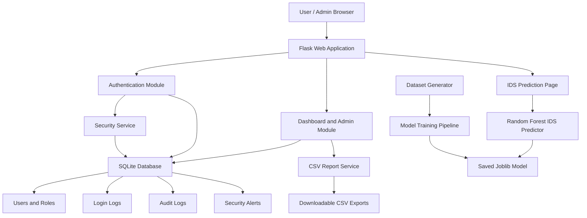
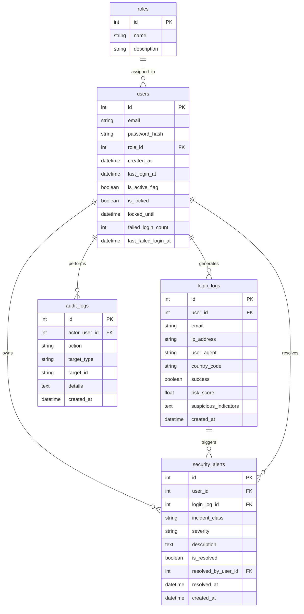
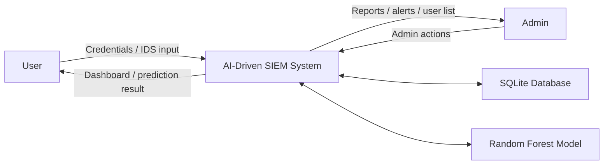
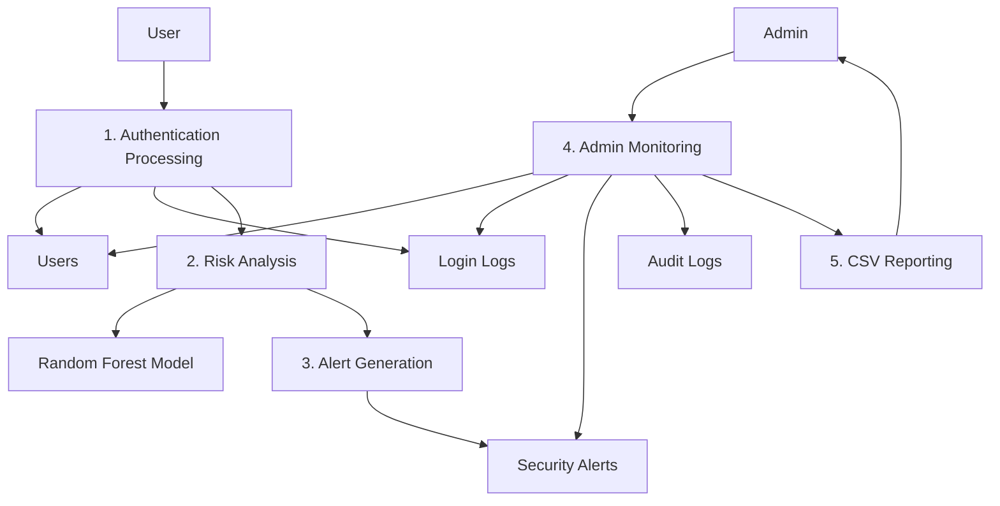
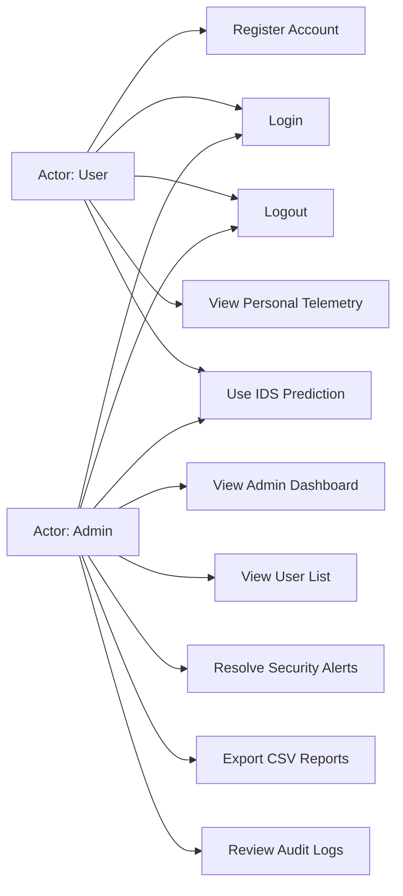
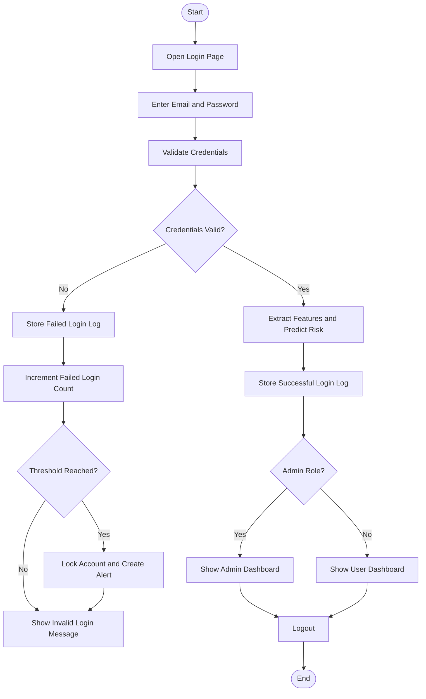

# Diagrams

## Architecture Diagram

```mermaid
flowchart TB
    U["User / Admin Browser"] --> F["Flask Web Application"]
    F --> A["Authentication Module"]
    F --> D["Dashboard and Admin Module"]
    F --> P["IDS Prediction Page"]
    A --> S["Security Service"]
    P --> M["Random Forest IDS Predictor"]
    M --> J["Saved Joblib Model"]
    S --> DB["SQLite Database"]
    D --> DB
    A --> DB
    DB --> T1["Users and Roles"]
    DB --> T2["Login Logs"]
    DB --> T3["Audit Logs"]
    DB --> T4["Security Alerts"]
    D --> R["CSV Report Service"]
    R --> C["Downloadable CSV Exports"]
    G["Dataset Generator"] --> TR["Model Training Pipeline"]
    TR --> J
```

## ER Diagram

```mermaid
erDiagram
    roles ||--o{ users : assigned_to
    users ||--o{ login_logs : generates
    users ||--o{ audit_logs : performs
    users ||--o{ security_alerts : owns
    login_logs ||--o{ security_alerts : triggers
    users ||--o{ security_alerts : resolves

    roles {
        int id PK
        string name
        string description
    }

    users {
        int id PK
        string email
        string password_hash
        int role_id FK
        datetime created_at
        datetime last_login_at
        boolean is_active_flag
        boolean is_locked
        datetime locked_until
        int failed_login_count
        datetime last_failed_login_at
    }

    login_logs {
        int id PK
        int user_id FK
        string email
        string ip_address
        string user_agent
        string country_code
        boolean success
        float risk_score
        text suspicious_indicators
        datetime created_at
    }

    audit_logs {
        int id PK
        int actor_user_id FK
        string action
        string target_type
        string target_id
        text details
        datetime created_at
    }

    security_alerts {
        int id PK
        int user_id FK
        int login_log_id FK
        string incident_class
        string severity
        text description
        boolean is_resolved
        int resolved_by_user_id FK
        datetime resolved_at
        datetime created_at
    }
```

## DFD Level 0

```mermaid
flowchart LR
    E1["User"] -->|Credentials / IDS input| P0["AI-Driven SIEM System"]
    E2["Admin"] -->|Admin actions| P0
    P0 -->|Dashboard / prediction result| E1
    P0 -->|Reports / alerts / user list| E2
    P0 <--> D1["SQLite Database"]
    P0 <--> D2["Random Forest Model"]
```

## DFD Level 1

```mermaid
flowchart TB
    U["User"] --> P1["1. Authentication Processing"]
    P1 --> D1["Users"]
    P1 --> D2["Login Logs"]
    P1 --> P2["2. Risk Analysis"]
    P2 --> M["Random Forest Model"]
    P2 --> P3["3. Alert Generation"]
    P3 --> D3["Security Alerts"]
    A["Admin"] --> P4["4. Admin Monitoring"]
    P4 --> D1
    P4 --> D2
    P4 --> D3
    P4 --> D4["Audit Logs"]
    P4 --> P5["5. CSV Reporting"]
    P5 --> A
```

## Use Case Diagram

```mermaid
flowchart LR
    User["Actor: User"]
    Admin["Actor: Admin"]

    UC1["Register Account"]
    UC2["Login"]
    UC3["Logout"]
    UC4["View Personal Telemetry"]
    UC5["Use IDS Prediction"]
    UC6["View Admin Dashboard"]
    UC7["View User List"]
    UC8["Resolve Security Alerts"]
    UC9["Export CSV Reports"]
    UC10["Review Audit Logs"]

    User --> UC1
    User --> UC2
    User --> UC3
    User --> UC4
    User --> UC5

    Admin --> UC2
    Admin --> UC3
    Admin --> UC5
    Admin --> UC6
    Admin --> UC7
    Admin --> UC8
    Admin --> UC9
    Admin --> UC10
```

## Activity Diagram

```mermaid
flowchart TD
    Start([Start]) --> LoginPage["Open Login Page"]
    LoginPage --> Input["Enter Email and Password"]
    Input --> Validate["Validate Credentials"]
    Validate --> Decision{Credentials Valid?}
    Decision -->|Yes| Risk["Extract Features and Predict Risk"]
    Risk --> LogSuccess["Store Successful Login Log"]
    LogSuccess --> RoleCheck{Admin Role?}
    RoleCheck -->|Yes| AdminDash["Show Admin Dashboard"]
    RoleCheck -->|No| UserDash["Show User Dashboard"]
    Decision -->|No| LogFail["Store Failed Login Log"]
    LogFail --> CountFail["Increment Failed Login Count"]
    CountFail --> LockCheck{Threshold Reached?}
    LockCheck -->|Yes| Lock["Lock Account and Create Alert"]
    LockCheck -->|No| Error["Show Invalid Login Message"]
    Lock --> Error
    AdminDash --> Logout["Logout"]
    UserDash --> Logout
    Logout --> End([End])
```
